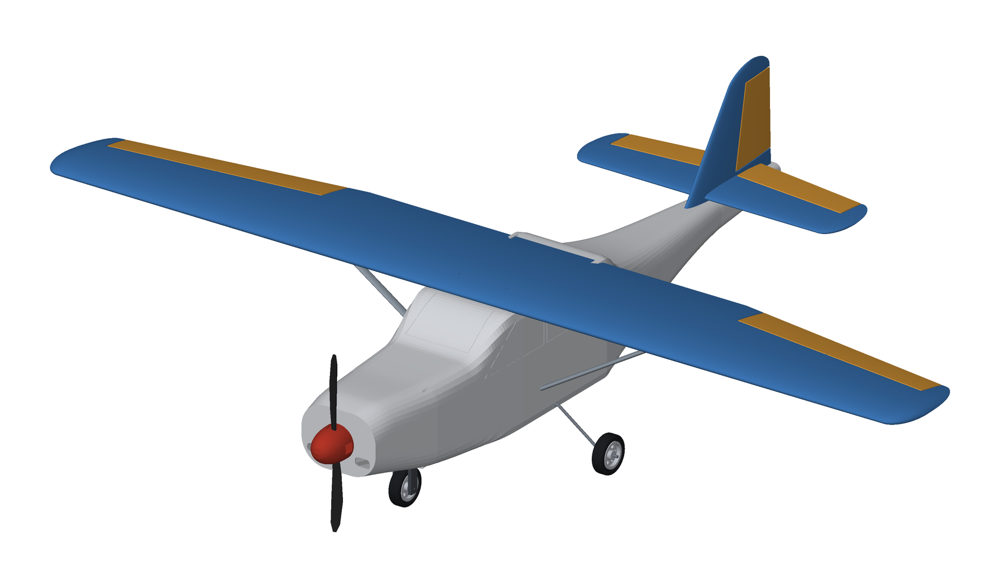
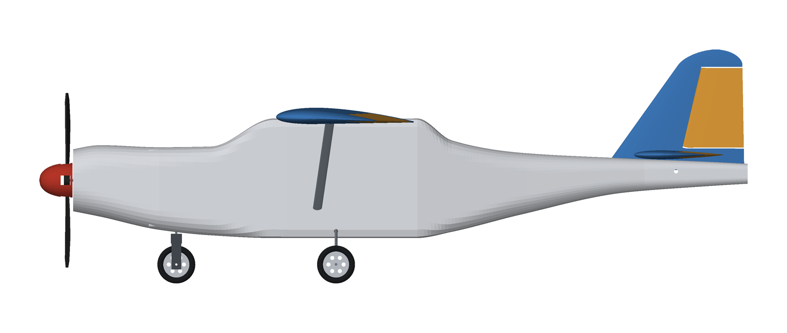
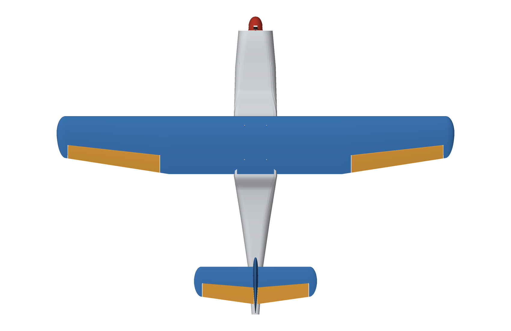
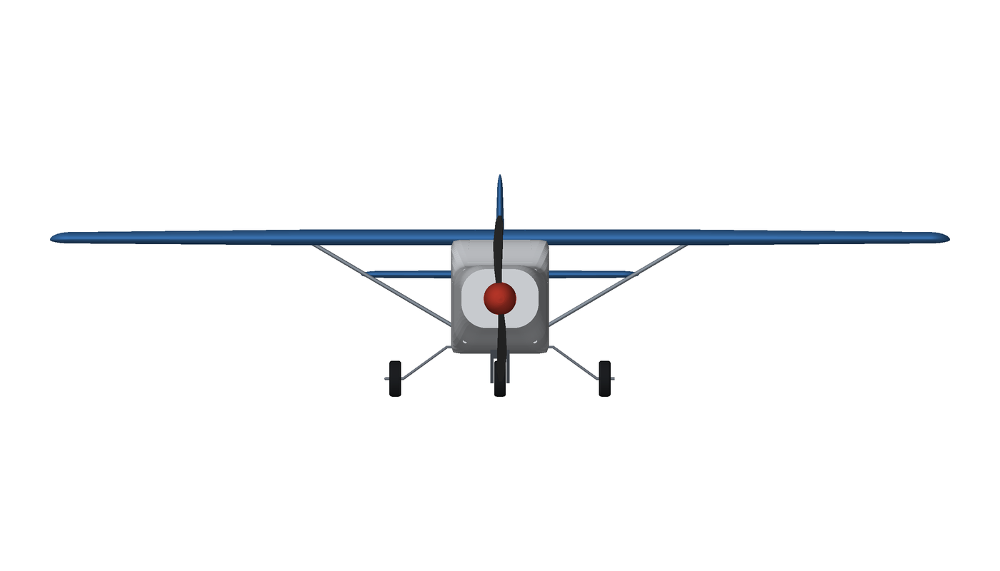
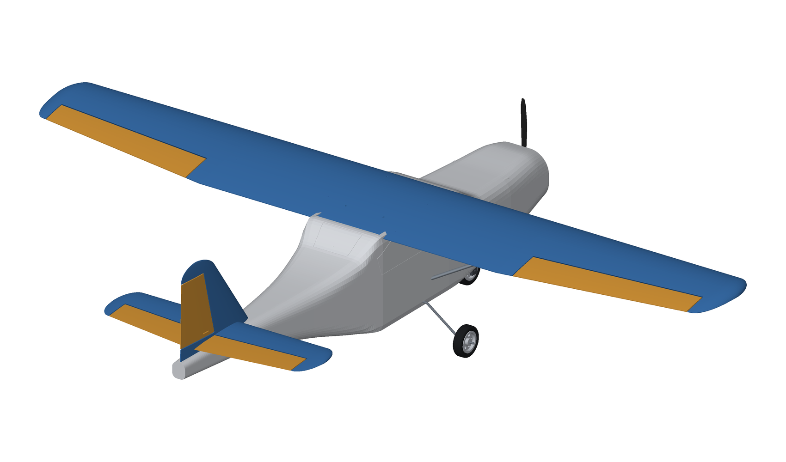
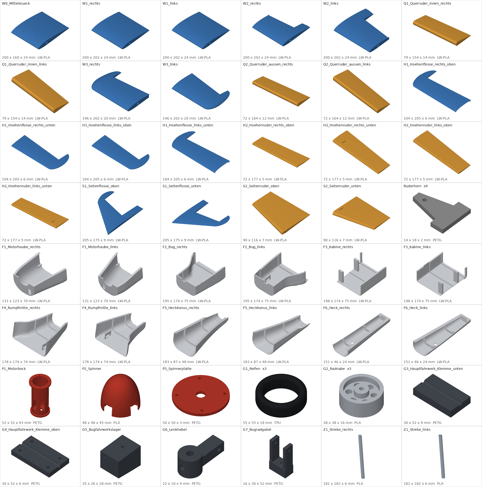

# 1:8 RC-Flugzeug im Stil einer Cessna 172 – zum Selbstdrucken

Einmotoriger Hochdecker (Tragflächenstreben, Bugradfahrwerk, Zugpropeller) im Maßstab **1:8** einer Cessna 172,
vollständig als **druckbare STL-Dateien** für Drucker ab **220 × 220 mm** Druckbett, parametrisch erzeugt (Python).



> **Status: Entwurf, nicht geflogen.** Geometrie, Druckbarkeit, Ruderfreigang und Schwerpunkt sind rechnerisch geprüft
> (siehe unten), das Flugzeug wurde aber **nicht gebaut und nicht geflogen**. Gewichte sind Schätzungen aus dem Modellvolumen.
> Plane Probe-Drucke und einen vorsichtigen Erstflug ein.

## Eckdaten

| | |
|---|---|
| Vorbild / Maßstab | Cessna 172, 1:8 |
| Spannweite / Länge / Höhe | **1375 mm** / ca. 1030 mm (mit Spinner) / 340 mm |
| Flügel | NACA 2412 (Unterseite ab 25 % eben, druckfreundlich), Tiefe 200 → 140 mm, **25,2 dm²**, Streckung 7,5, 2° Einstellwinkel |
| Leitwerk | Höhenleitwerk 425 mm (NACA 0010), Seitenleitwerk 175 mm hoch (NACA 0009) |
| Steuerung | Quer-, Höhen-, Seitenruder, Gas, steuerbares Bugrad (5 Servos 9 g) |
| Antrieb (Empfehlung) | Außenläufer 28xx ≈ 1000 kV, 30-A-Regler, 3S 2200 mAh, Luftschraube 10×6″ |
| Abfluggewicht (Schätzung) | **≈ 1,6 kg** (1,09 kg gedruckt + 0,53 kg Elektronik/Kohlefaser) |
| Flächenbelastung | ≈ 64 g/dm², Überziehgeschwindigkeit ≈ 9 m/s |
| Schwerpunkt (Rechenwert) | 58 mm hinter der Flügelvorderkante ≈ **31 % MAC**, Stabilitätsmaß ≈ 14 % MAC |
| Druckteile | **48 STL-Dateien / 55 Drucke**, größte Grundfläche 205 × 205 mm, höchstes Teil 93 mm |
| Material | ca. 920 g **LW-PLA**, 70 g PETG, 45 g PLA, 30 g TPU (siehe `docs/DRUCKEINSTELLUNGEN.md`) |

Die Auswertung stammt aus `docs/kennzahlen.json` (wird beim Generieren neu geschrieben).

## Ansichten

| | |
|---|---|
|  |  |
|  |  |

## Inhalt des Repositories

| Pfad | Inhalt |
|---|---|
| `stl/` | **Alle druckfertigen STL** (bereits in Druckausrichtung), nach Gruppen: `Fluegel/`, `Querruder/`, `Leitwerk/`, `Rumpf/`, `Antrieb/`, `Fahrwerk/`, `Streben/`, `Kleinteile/` |
| `docs/DRUCKLISTE.md` | Teile, Stückzahl, Material, Druckgröße, Masse |
| `docs/DRUCKEINSTELLUNGEN.md` | Material, Slicer-Einstellungen, Ausrichtung, Nacharbeit |
| `docs/ZUKAUFTEILE.md` | Elektronik, Kohlefaser, Draht, Schrauben mit Maßen |
| `docs/BAUANLEITUNG.md` | Zusammenbau, Schwerpunkt, Ruderausschläge, Erstflug |
| `docs/fahrwerk_biegeschablone.pdf` | Biegeschablone Hauptfahrwerk **1:1** (A4 quer) |
| `docs/stueckliste.csv`, `docs/kennzahlen.json` | Teileliste (CSV), Kennzahlen |
| `docs/img/` | Bilder (Ansichten, Explosionszeichnung, Teile-Übersicht) |
| `cessna/` | Generator (Python): Maße in `params.py`, Geometrie in `wing.py`, `fuselage.py`, `tail.py`, … |
| `tests/` | Automatische Prüfungen |



## So geht es los (Kurzfassung)

1. **Material besorgen:** ca. 1 kg LW-PLA (Flügel/Rumpf/Leitwerk), etwas PETG, PLA und TPU → `docs/DRUCKEINSTELLUNGEN.md`.
2. **Zukaufteile bestellen** → `docs/ZUKAUFTEILE.md` (Kohlefaser-Rohre 10/8 mm in 660 mm, Federstahldraht, 5 Mikroservos, …).
3. **Zuerst `W0_Mittelstueck` drucken und wiegen** (Soll ≈ 58 g) – damit Flow/Temperatur für LW-PLA richtig stehen.
4. Alle Teile drucken: STL liegen fertig ausgerichtet vor, **keine Stützen** außer optional unter der Flügelnase.
5. Zusammenbau nach `docs/BAUANLEITUNG.md` (Flügel → Leitwerk → Rumpf → Antrieb → Fahrwerk → Endmontage).
6. Schwerpunkt einstellen (58 mm hinter der Flügelvorderkante), Ruder einstellen, **vorsichtig** einfliegen.

## Konstruktionsprinzip

* **Hohlbauweise für LW-PLA:** Außenhaut 1,1 mm (Flügel), 1,2 mm (Rumpf), 0,85 mm (Leitwerk) mit Rippen/Spanten;
  Holm = **CFK-Rohr 10/8 mm** durch alle Flügelabschnitte (gedruckte Holmhülsen), Verbinderstab in der Mitte.
* **Druckbett 220 × 220 mm:** Der Flügel besteht aus 4 Abschnitten je Seite/Mitte (je ≤ 202 mm Spannweite), der Rumpf aus
  6 Segmenten × links/rechts mit **Steckmuffen**, die Leitwerksflächen sind in Ober-/Unterschale geteilt.
* **Das Flügelmittelstück ist das Kabinendach** (wie bei der Cessna): Der Rumpf hat unter dem Flügel eine offene Kabine mit
  Spantbalken; der Flügel liegt in einem passgenauen Sattel und wird mit 4 Schrauben gehalten. Der Akku sitzt im Bugfach
  (Einschub von der Kabine aus) → wenige bewegliche Teile, Akku in Schwerpunktnähe.
* **Ruder mit Rundnase + Hohlkehle:** Querruder, Höhen- und Seitenruder lassen sich in der CAD-Prüfung um ±30° ausschlagen,
  ohne an Festteile zu stoßen (Scharnier: Gewebeband beidseitig).
* **Fenster** sind als flache Gravuren (Lackiermaske) in den Rumpf eingearbeitet; Streben sind kosmetisch.
* **Druckfreundlich:** Alle Rumpfwände sind eben (stückweise linear verjüngt), damit sie flach auf dem Bett liegen; Teile
  sind so geteilt, dass keine Stützen nötig sind.

## Prüfungen (automatisch, `pytest`)

* alle Teile gültige geschlossene Volumenkörper, passen auf 220 × 220 × 250 mm (mit 4 mm Rand);
* **keine Überschneidungen** im Zusammenbau (paarweise Prüfung, inkl. Sättel für Flügel/Leitwerk);
* Ruderfreigang ±30°; Holm liegt innerhalb des Profils;
* Schwerpunkt 22–34 % MAC, Stabilitätsmaß ≥ 8 %, Hauptfahrwerk ≥ 15 mm hinter dem Schwerpunkt;
* STL-Export wasserdicht (nach Rundung auf float32, wie beim Slicer), Einzelteile mit Boden auf z = 0.

## Anpassen und neu erzeugen

```bash
pip install -r requirements.txt
python -m cessna.build            # erzeugt STL, Druckliste, Bilder, Kennzahlen (~25 s)
python -m cessna.build --no-images --overlaps    # schneller Check inkl. Überschneidungsprüfung
python -m pytest -q tests         # Prüfungen
```

Alle Maße stehen in `cessna/params.py` (Flügel, Rumpftabelle, Leitwerk, Fahrwerk, Wandstärken, Druckbett). Der Generator
liefert zu jedem Lauf die Kennzahlen (Masse, Schwerpunkt, Neutralpunkt). Kleinere Druckbetten brauchen eine feinere
Teilung (Segmentgrenzen in `FUSE_SEGMENTS`, Abschnittsbreite `WING_PANEL_SPAN`); die Prüfung meldet jedes Teil, das nicht passt.

## Bekannte Grenzen / offene Punkte

* **Nicht geflogen.** Neutralpunkt/Stabilität sind Näherungsrechnungen (Standardmethode), keine Strömungsrechnung.
* Gewichte sind aus dem Volumen geschätzt (LW-PLA 0,55 g/cm³). Echte Teile können ±20 % abweichen → Schwerpunkt nach dem Bau
  ausmessen (Akkulage, Trimmblei im Bug).
* Der Flügel ist **einteilig** (1375 mm), nicht teilbar. Keine Klappen, keine Radverkleidungen, keine Dreiecksfenster.
* Profil weicht für den Druck vom Original ab (flache Unterseite hinter 25 % Tiefe); die Nasenunterseite braucht ggf. einen
  kleinen Stützkeil oder Brim.
* Die Streben sind nur aufgeklebt (kosmetisch). Die Ruderscharniere sind Gewebeband (kein Kugelscharnier).
* Die Hauptgestänge im Heck laufen in gebohrten Kanälen; die Z-Bügel am Heck sind frei zu biegen.
* Keine Lizenz festgelegt – wenn du das Repository öffentlich machst, lege eine passende Lizenz fest.
