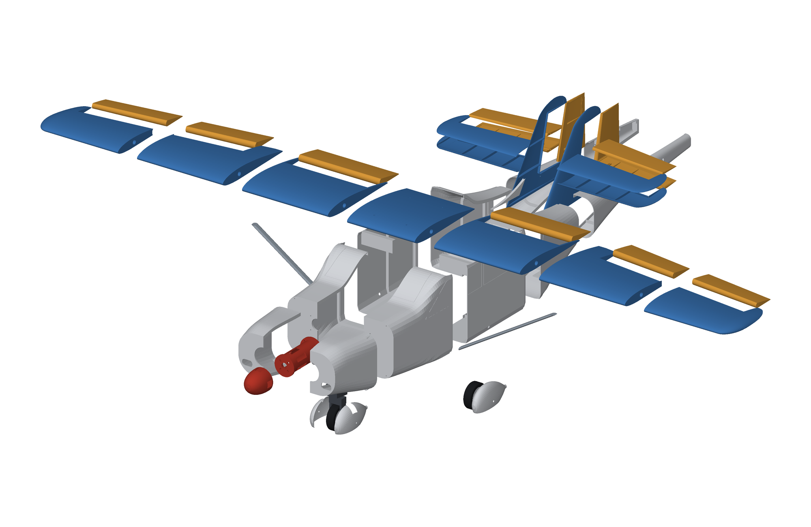
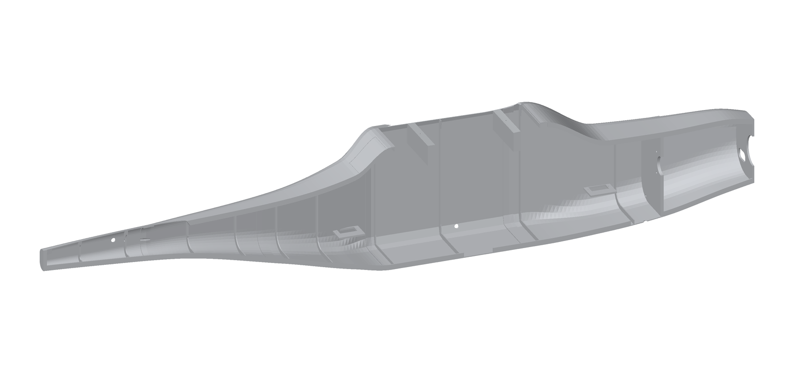
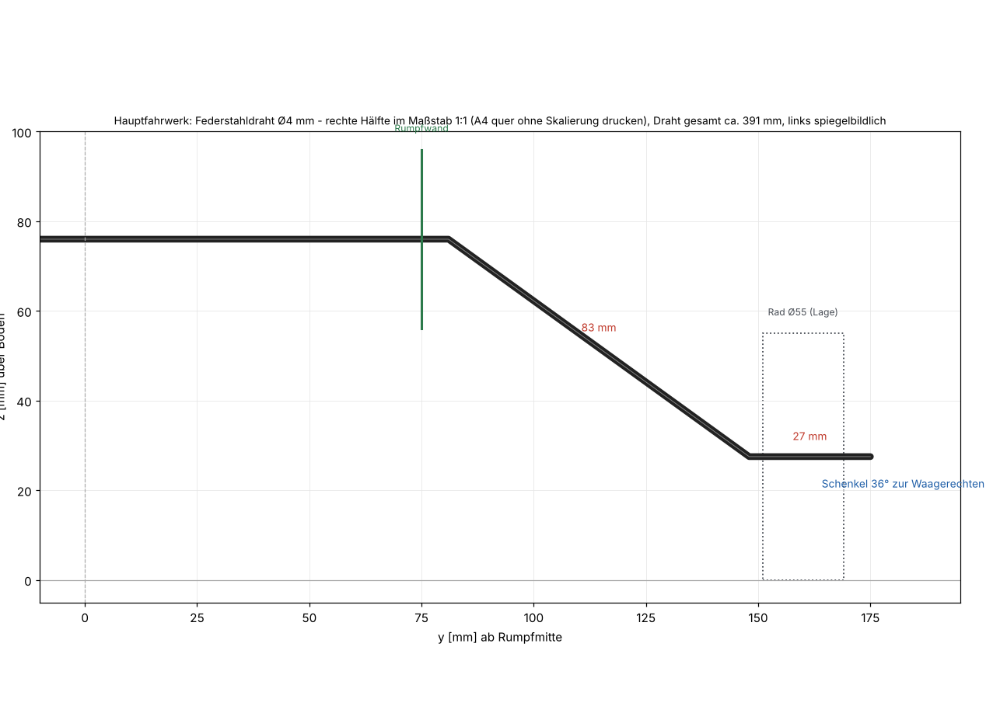

# Bauanleitung

Reihenfolge: **Flügel → Leitwerk → Rumpf → Antrieb → Fahrwerk → Elektronik/Gestänge → Endmontage → Schwerpunkt**.
Teilenamen entsprechen den STL-Dateien (`stl/…`) und der Druckliste (`docs/DRUCKLISTE.md`).

**Werkzeug/Kleber:** Epoxy 30 min (CFK, tragende Verbindungen), dünner + mittelviskoser Sekundenkleber mit Aktivator
(LW-PLA-Verklebungen; „schaumverträglich" ist unkritisch), feines Schleifpapier (240), Lineal/Richtbrett,
Messer, Schraubendreher, Seitenschneider, Biegezange für Federstahl, Gewebeband.

---

## 1. Flügel (einteilig, 1375 mm)

Teile: `W0` (Mitte), `W1`/`W2`/`W3` je links/rechts, 2× CFK-Rohr 10/8 × 660 mm, 1× Verbinderstab Ø 7,8 × 200 mm,
`Q1`/`Q2` Querruder.

1. **Trockenmontage.** Stecke beide CFK-Rohre durch die Holmbohrungen (Ø 10,4 mm, in den Rippen) von `W3` bis `W0`.
   Die Rohre reichen von der Flügelmitte bis in den Randbogen (660 mm). In der Mitte stecken die beiden Rohrenden
   auf dem **Verbinderstab** (je 100 mm). Alles muss ohne Gewalt sitzen; ggf. Bohrungen mit einer Rundfeile oder
   einer 10-mm-Reibahle kalibrieren.
2. **Verkleben.** Epoxy dünn in die Holmhülsen jedes Abschnitts geben (nicht ins ganze Rohr!), Abschnitte auf die Rohre
   schieben und die Stirnflächen (umlaufende Haut + Endrippen, 3 mm Rand) mit Sekundenkleber/Epoxy verbinden. Flügel
   dabei flach auf einem Richtbrett ausrichten (Vorderkante gerade!). Reihenfolge: `W0` + `W1` + `W2` + `W3` je Seite.
3. **Servos.** In `W2` sitzt der Servoschacht (Lage y = ±352 mm). 9-g-Servo mit **Abtrieb nach unten** einsetzen: der
   Flansch liegt auf dem Rand des Schachts, Servo mit Heißkleber sichern. Kabel durch die Kerbe im Schacht und die
   Rippenlöcher (hinter dem Holm) nach innen führen. Das Kabel tritt in der Flügelmitte durch das **Langloch in der
   Unterseite von `W0`** in die Kabine aus.
4. **Querruder.** `Q1` (innen) und `Q2` (außen) liegen mit ihrem Stoß bei y = 485 mm aneinander; mit Sekundenkleber (dünn, Stirnflächen
   plus Endrippen) zu **einem** Ruder verbinden (je Seite); optional 3-mm-CFK-Stab als Dorn (Löcher von Hand bohren). Ruderhorn (`Ruderhorn`)
   in den Schlitz an der Unterseite von `Q1` kleben (Epoxy). Scharniere: transparentes Band **oben und unten** über die
   1,6-mm-Fuge kleben; Ruder in der Mitte „biegen“, bis es leicht schwingt. Die Konstruktion lässt ±30° Ausschlag
   zu (virtuell geprüft).
5. **Anlenkung.** Gestänge Ø 1,5 mm (ca. 60 mm) vom Servohebel zum Horn. Servohebel parallel zur Vorderkante in Mittelstellung.
6. **Landeklappen.** `W1` hat einen zweiten Servoschacht (y = ±150 mm). Klappe `K1` genauso wie das Querruder mit
   Gewebeband anschlagen, Horn in den Schlitz an der Unterseite (y = ±172 mm). Servo so einstellen, dass die Klappe
   eingefahren bündig ist und bis **35° nach unten** fährt (die Konstruktion erlaubt ±35°).

Optional: Flügel vor dem Verkleben auf Verzug prüfen (beide Spitzen müssen auf dem Richtbrett aufliegen).

## 2. Leitwerk

Teile: `H1` Höhenflosse (rechts/links, je oben+unten), `H2` Höhenruder (rechts/links, je oben+unten),
`S1` Seitenflosse (oben/unten), `S2` Seitenruder (oben/unten), CFK Ø 4 × 395, CFK Ø 2 × 370, 2× Ruderhorn.

1. **Schalen verkleben.** Je zwei Schalen (oben/unten) an der Naht mit dünnem Sekundenkleber; der Flansch
   (3 mm breit) und die Rippen sind die Klebefläche. Auf einer ebenen Platte trocknen lassen (kein Verzug).
2. **Höhenflosse:** CFK-Stab Ø 4 mm durch beide Hälften (Holmbohrung 30 mm hinter der Vorderkante) kleben; Hälften in der Mitte stumpf
   verkleben (Endrippen). **Höhenruder:** 2-mm-Stab (370 mm) durch beide Nasen (Bohrung auf der Scharnierachse) **und durch die Querbohrung
   in der Seitenflosse** (die Ruder sitzen links/rechts der Flosse, 6,5 mm Abstand), Stab nur in den Rudernasen verkleben, damit
   er in der Flosse frei dreht. Horn in den Schlitz der **linken** Unterseite (Lage y = 34 mm); Scharnierband beidseitig.
3. **Seitenflosse/-ruder:** Schalen verkleben; Seitenruder mit Scharnierband (beidseitig) an die Flosse; Horn
   auf der **rechten** Seite in den Schlitz.
4. Ruderausschläge probeweise von Hand: Höhenruder und Seitenruder müssen frei laufen (±30° geprüft).

## 3. Rumpf

Der Rumpf besteht aus 6 Segmenten mit je linker/rechter Hälfte. **Erst Hälften verkleben, dann Segmente verbinden.**

1. **Hälften:** Je Segment links+rechts an der Naht verkleben (Klebeflansch oben/unten, Spanten und Wände). Dabei auf
   einer ebenen Fläche liegen lassen und mit Klammern/Gewebeband fixieren. Segmente nach dem Verkleben auf Maß prüfen
   (Muffen dürfen nicht klemmen).
2. **Segmente verbinden:** `F2` → `F3` → `F4` → `F5` → `F6` über die Steckmuffen (jeweils nach hinten in das nächste
   Segment). Trocken stecken, Rumpf auf Geradheit prüfen (Blick von vorn/oben), dann mit Epoxy/Sekundenkleber
   verkleben. **Nach dem Aushärten:** Flügel probehalber auflegen (er sitzt in einem Sattel exakt auf der Kabine).
3. **Motorhaube `F1`** wird nur am Brandschott verschraubt (4× M2,5 × 10 von innen durch den Brandschott in die Dome der Haube);
   deshalb nur die beiden Hälften von `F1` miteinander verkleben.
4. **Servoböden:** In `F4` (x = 538) sitzen zwei Servoböden (links: Höhenruder, rechts: Seitenruder), in `F2` links
   der Bugradservo (x = 190). Servos mit **Abtrieb nach oben** einhängen (Flansch liegt auf dem Boden) und mit zwei
   M2-Blechschrauben fixieren.
5. **Gestänge Heck:** Zwei Kanäle (Ø 3,8 mm) führen vom Servohebel durch die Spanten zu den Austrittslöchern in der
   Heckwand (x = 876). Ø-2-mm-Stab (CFK) vom Servohebel bis zum Austritt; dahinter ein kurzer Z-Bügel (Ø 1,5 mm)
   zum Ruderhorn. Rudern in Neutral: Servohebel mittig, Ruder mittig.
6. **Brandschott:** Der Brandschott (4 mm, Teil von `F2`) trägt Motorbock und Haube. Lochbild für den Motorbock:
   4 × M3 auf 30-mm-Quadrat.

## 4. Antrieb

Teile: `P1` Motorbock, `P2` Spinnerkegel, `P3` Spinnerplatte.

1. Motor an die **Vorderseite** des Motorbock-Flansches schrauben (16- oder 19-mm-Kreuz, 4× M3 × 8).
   Motorkabel durch den Hohlraum des Bocks nach hinten führen (der Bock lässt Kühlluft durch die 6 Schlitze).
2. Motorbock mit 4× M3 × 10 an den Brandschott (30-mm-Quadrat). Motorwelle liegt dann in der Haubenmitte; der Glockenrand
   steht bündig hinter der Haubenvorderkante (Hauben-Ausschnitt Ø 42 mm).
3. Regler im Haubeninneren neben dem Motorbock (Klett), Kabelweg durch die Löcher im Brandschott.
4. Propelleradapter mit **Spinnerplatte** montieren (Platte direkt hinter der Luftschraube), Luftschraube,
   **Spinnerkegel** mit 4× M2,5 × 10 auf die Platte. Die Blätter laufen durch die Aussparungen am Rand des Kegels.

## 5. Fahrwerk

**Hauptfahrwerk:** 4-mm-Federstahldraht nach `docs/fahrwerk_biegeschablone.pdf` biegen (rechte Hälfte 1:1, links gespiegelt).
Der Draht verläuft als Brücke quer durch den Rumpf (Höhe z = 76 mm) und tritt durch zwei Löcher in den Seitenwänden
aus; die Schenkel gehen mit ca. 37° nach unten zu den Achsstummeln.

1. Untere Klemme `G3` auf den Rumpfboden von `F3` kleben (Lage x = 382 ± 15; sie überbrückt die Naht).
2. Draht durch die Wandlöcher legen, in die Nut der Klemme drücken, obere Klemme `G4` mit 2× M3 × 12 festschrauben.
3. Räder: Reifen (TPU) auf die Naben (`G2`) kleben, Naben auf die Achsstummel (Stellringe außen und innen).

**Bugfahrwerk:** Gabel `G7` (Brücke nach unten drucken!) über das untere Ende des 3-mm-Drahts (56 mm) kleben; Achse Ø 3 mm
durch Gabel und Nabe; Lager `G5` auf den Rumpfboden und an den Brandschott kleben (Bohrung Ø 3,5 für den Draht); oben
sitzt der Lenkhebel `G6` mit M3-Madenschraube; Gestänge Ø 1,2 mm vom Bugradservo zum Hebel.

Empfohlener Lenkausschlag ca. ±30°; Bugradservo über **Y-Kabel auf den Seitenruderkanal** legen.

**Radverkleidungen (optional):** `G8` (Haupträder, je innen/außen) und `G9` (Bugrad) paarweise verkleben. Die
Hauptrad-Verkleidung wird über das Drahtende geschoben (innen ist ein Schlitz für den Fahrwerksschenkel), Rad
dazwischen, Stellring außen; die Verkleidung mit einem Tropfen Sekundenkleber am Draht gegen Verdrehen sichern.
Die Bugrad-Verkleidung sitzt auf der Achse zwischen Gabel und Stellringen, die Gabel ragt oben durch den Schlitz.

## 6. Endmontage

1. **Leitwerk:** Seitenflosse `S1` senkrecht von oben in den Schlitz der Heckwand (die untersten 12–18 mm der Flosse
   stecken im Heck) stecken, ausrichten (Lot, Draufsicht) und verkleben. Höhenflossenhälften seitlich an die Flosse
   und auf die Heckwand kleben; **Einstellwinkel 0°** gegenüber der Rumpf-Längsachse kontrollieren.
   Zum Schluss die **Rückenflosse** `S3` mittig auf den Rumpfrücken (ab x = 690 mm) und an die Vorderkante der Seitenflosse kleben.
2. **Flügel:** Auf den Sattel legen; 4× M3 × 20 durch die Dome in `W0` (x = 327 / 445 mm, y = ±38 mm) in die Spantbalken des Rumpfes
   schrauben. Servokabel in die Kabine führen.
3. **Streben (optional):** `Z1_Strebe_rechts/links` mit Epoxy an die Rumpfseitenwand (z = 110 mm) und die Flügelunterseite
   (Stoß W1/W2, x = 78 mm hinter der Flügelvorderkante) kleben. Sie sind **kosmetisch** und tragen kaum Last.
4. **Akku:** Längs im Bugfach (x ≈ 170–283 mm), Einschub von der Kabine aus nach vorn, mit Klettband sichern;
   so lässt sich der Schwerpunkt über die Akkulage (und Trimmblei) einstellen.
5. **Empfänger:** in die Kabine (Klett); Antenne weg von Regler/Motor.

## 7. Schwerpunkt und Einstellungen

<!-- AUTO:schwerpunkt -->
| Größe | Wert |
|---|---|
| **Schwerpunkt** | **60 mm hinter der Flügelvorderkante** (Rechenwert 355 mm hinter der Haubenvorderkante); zulässig: 44–65 mm = 24–35 % MAC |
| MAC | 185 mm |
| Auswiegen | Flugzeug an den Punkten bei **x = 355 mm** (am Rumpf von der Haubenvorderkante gemessen) unterstützen, Nase leicht unten |
<!-- /AUTO:schwerpunkt -->

Ist die Nase zu leicht: Akku nach vorn, bei Bedarf Trimmblei (Klett) im Bug (Motorhaube); 20 g im Bug verschieben den
Schwerpunkt um ca. 4 mm nach vorn.

| Ruder | Ausschlag | Expo |
|---|---:|---:|
| Querruder | ± 14° (niedrig ± 9°) | 30 % |
| Höhenruder | ± 12° | 25 % |
| Seitenruder | ± 20° | 20 % |
| Landeklappen | Start 15°, Landung 30–35° (nach unten); Höhenruder bei Klappe ggf. 2–3° tiefer mischen | – |
| Bugrad | ± 30° (Mischung mit Seite) | – |

Gaskurve/Motor: Erst ohne Luftschraube prüfen (Drehrichtung, Failsafe). Reichweite testen.

## 8. Erstflug

* Ungeprüfter Entwurf! Das Flugzeug wurde **gebaut und gerechnet, aber nicht geflogen**. Gewichte, Schwerpunkt und
  Leistung sind Rechenwerte. Rechne mit Abweichungen und Probeflügen. Erstflug bei Windstille, Gras, mit Erfahrung.
* Reserve: Das Modell hat nur ca. 0,5–0,6 Schub/Gewicht (Richtwert) und 64 g/dm² Flächenbelastung; Überziehgeschwindigkeit ca. 9 m/s.
  Starte mit Vollgas gegen den Wind und steige flach.
* Prüfe nach jedem Flug Scharniere, Holm-Verklebung, Fahrwerksdraht und Schrauben.
