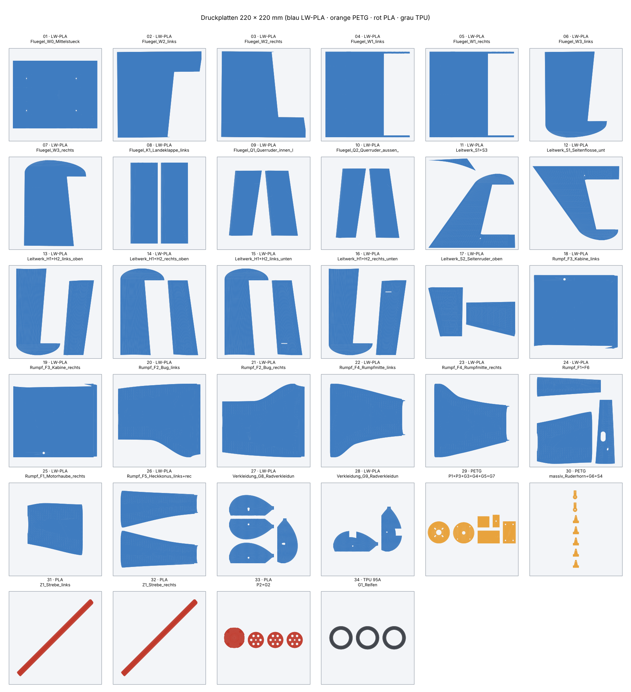

# Druckplatten (3MF, fertig angeordnet)

Alle druckbaren Teile, nach **Material und Slicer-Einstellung** auf Platten für ein **220 × 220-mm-Bett**
verteilt (Ender 3, Prusa MK3/MK4, Bambu A1/P1/X1, Voron, …). Die Dateien liegen in `druckplatten/`.
Die Teile stehen in Druckausrichtung und mit 8 mm Abstand (Platz für Brim). Größere Betten: einfach
mehrere Platten im Slicer zusammenlegen oder „Anordnen“ drücken.

**So geht's:** 3MF-Datei im Slicer öffnen (PrusaSlicer, Bambu Studio, OrcaSlicer, Cura) → Druckerprofil wählen →
Einstellungen aus der Spalte „Einstellung“ setzen → slicen → G-Code/Druckauftrag an den Drucker.
Fragt der Slicer, ob das Objekt aus mehreren Teilen besteht: **Nein** (jede Datei enthält einzelne Objekte).

> Zuerst **Platte 01** (`W0_Mittelstueck`) drucken und wiegen: Soll ca. 57 g. Weicht das stark ab,
> Fluss/Temperatur für LW-PLA nachstellen (siehe `docs/DRUCKEINSTELLUNGEN.md`), bevor du den Rest druckst.

| Platte | Datei | Material | Einstellung | Teile | Masse | Höhe |
|---:|---|---|---|---|---:|---:|
| 01 | `01_LW-PLA_Fluegel_W0_Mittelstueck.3mf` | LW-PLA | Wand 1,1 mm, 0 % Füllung, Boden/Deckel 3 Schichten, Brim 3–5 mm | `W0_Mittelstueck` | 57 g | 24 mm |
| 02 | `02_LW-PLA_Fluegel_W2_links.3mf` | LW-PLA | Wand 1,1 mm, 0 % Füllung, Boden/Deckel 3 Schichten, Brim 3–5 mm | `W2_links` | 53 g | 24 mm |
| 03 | `03_LW-PLA_Fluegel_W2_rechts.3mf` | LW-PLA | Wand 1,1 mm, 0 % Füllung, Boden/Deckel 3 Schichten, Brim 3–5 mm | `W2_rechts` | 53 g | 24 mm |
| 04 | `04_LW-PLA_Fluegel_W1_links.3mf` | LW-PLA | Wand 1,1 mm, 0 % Füllung, Boden/Deckel 3 Schichten, Brim 3–5 mm | `W1_links` | 55 g | 24 mm |
| 05 | `05_LW-PLA_Fluegel_W1_rechts.3mf` | LW-PLA | Wand 1,1 mm, 0 % Füllung, Boden/Deckel 3 Schichten, Brim 3–5 mm | `W1_rechts` | 55 g | 24 mm |
| 06 | `06_LW-PLA_Fluegel_W3_links.3mf` | LW-PLA | Wand 1,1 mm, 0 % Füllung, Boden/Deckel 3 Schichten, Brim 3–5 mm | `W3_links` | 42 g | 20 mm |
| 07 | `07_LW-PLA_Fluegel_W3_rechts.3mf` | LW-PLA | Wand 1,1 mm, 0 % Füllung, Boden/Deckel 3 Schichten, Brim 3–5 mm | `W3_rechts` | 42 g | 20 mm |
| 08 | `08_LW-PLA_Fluegel_K1_Landeklappe_links+rechts.3mf` | LW-PLA | Wand 1,1 mm, 0 % Füllung, Boden/Deckel 3 Schichten, Brim 3–5 mm | `K1_Landeklappe_links`, `K1_Landeklappe_rechts` | 61 g | 14 mm |
| 09 | `09_LW-PLA_Fluegel_Q1_Querruder_innen_links+rechts.3mf` | LW-PLA | Wand 1,1 mm, 0 % Füllung, Boden/Deckel 3 Schichten, Brim 3–5 mm | `Q1_Querruder_innen_links`, `Q1_Querruder_innen_rechts` | 43 g | 14 mm |
| 10 | `10_LW-PLA_Fluegel_Q2_Querruder_aussen_links+rechts.3mf` | LW-PLA | Wand 1,1 mm, 0 % Füllung, Boden/Deckel 3 Schichten, Brim 3–5 mm | `Q2_Querruder_aussen_links`, `Q2_Querruder_aussen_rechts` | 37 g | 12 mm |
| 11 | `11_LW-PLA_Leitwerk_S1+S3.3mf` | LW-PLA | Wand 0,85 mm, 0 % Füllung, Boden/Deckel 3 Schichten, „dünne Wände“ an | `S1_Seitenflosse_oben`, `S3_Rueckenflosse` | 13 g | 9 mm |
| 12 | `12_LW-PLA_Leitwerk_S1_Seitenflosse_unten.3mf` | LW-PLA | Wand 0,85 mm, 0 % Füllung, Boden/Deckel 3 Schichten, „dünne Wände“ an | `S1_Seitenflosse_unten` | 10 g | 9 mm |
| 13 | `13_LW-PLA_Leitwerk_H1+H2_links_oben.3mf` | LW-PLA | Wand 0,85 mm, 0 % Füllung, Boden/Deckel 3 Schichten, „dünne Wände“ an | `H1_Hoehenflosse_links_oben`, `H2_Hoehenruder_links_oben` | 16 g | 6 mm |
| 14 | `14_LW-PLA_Leitwerk_H1+H2_rechts_oben.3mf` | LW-PLA | Wand 0,85 mm, 0 % Füllung, Boden/Deckel 3 Schichten, „dünne Wände“ an | `H1_Hoehenflosse_rechts_oben`, `H2_Hoehenruder_rechts_oben` | 16 g | 6 mm |
| 15 | `15_LW-PLA_Leitwerk_H1+H2_links_unten.3mf` | LW-PLA | Wand 0,85 mm, 0 % Füllung, Boden/Deckel 3 Schichten, „dünne Wände“ an | `H1_Hoehenflosse_links_unten`, `H2_Hoehenruder_links_unten` | 16 g | 6 mm |
| 16 | `16_LW-PLA_Leitwerk_H1+H2_rechts_unten.3mf` | LW-PLA | Wand 0,85 mm, 0 % Füllung, Boden/Deckel 3 Schichten, „dünne Wände“ an | `H1_Hoehenflosse_rechts_unten`, `H2_Hoehenruder_rechts_unten` | 16 g | 6 mm |
| 17 | `17_LW-PLA_Leitwerk_S2_Seitenruder_oben+unten.3mf` | LW-PLA | Wand 0,85 mm, 0 % Füllung, Boden/Deckel 3 Schichten, „dünne Wände“ an | `S2_Seitenruder_unten`, `S2_Seitenruder_oben` | 14 g | 7 mm |
| 18 | `18_LW-PLA_Rumpf_F3_Kabine_links.3mf` | LW-PLA | Wand 1,2 mm, 0 % Füllung, Boden/Deckel 3 Schichten | `F3_Kabine_links` | 58 g | 75 mm |
| 19 | `19_LW-PLA_Rumpf_F3_Kabine_rechts.3mf` | LW-PLA | Wand 1,2 mm, 0 % Füllung, Boden/Deckel 3 Schichten | `F3_Kabine_rechts` | 58 g | 75 mm |
| 20 | `20_LW-PLA_Rumpf_F2_Bug_links.3mf` | LW-PLA | Wand 1,2 mm, 0 % Füllung, Boden/Deckel 3 Schichten | `F2_Bug_links` | 55 g | 75 mm |
| 21 | `21_LW-PLA_Rumpf_F2_Bug_rechts.3mf` | LW-PLA | Wand 1,2 mm, 0 % Füllung, Boden/Deckel 3 Schichten | `F2_Bug_rechts` | 54 g | 75 mm |
| 22 | `22_LW-PLA_Rumpf_F4_Rumpfmitte_links.3mf` | LW-PLA | Wand 1,2 mm, 0 % Füllung, Boden/Deckel 3 Schichten | `F4_Rumpfmitte_links` | 29 g | 74 mm |
| 23 | `23_LW-PLA_Rumpf_F4_Rumpfmitte_rechts.3mf` | LW-PLA | Wand 1,2 mm, 0 % Füllung, Boden/Deckel 3 Schichten | `F4_Rumpfmitte_rechts` | 29 g | 74 mm |
| 24 | `24_LW-PLA_Rumpf_F1+F6.3mf` | LW-PLA | Wand 1,2 mm, 0 % Füllung, Boden/Deckel 3 Schichten | `F1_Motorhaube_links`, `F6_Heck_links`, `F6_Heck_rechts` | 38 g | 70 mm |
| 25 | `25_LW-PLA_Rumpf_F1_Motorhaube_rechts.3mf` | LW-PLA | Wand 1,2 mm, 0 % Füllung, Boden/Deckel 3 Schichten | `F1_Motorhaube_rechts` | 23 g | 70 mm |
| 26 | `26_LW-PLA_Rumpf_F5_Heckkonus_links+rechts.3mf` | LW-PLA | Wand 1,2 mm, 0 % Füllung, Boden/Deckel 3 Schichten | `F5_Heckkonus_links`, `F5_Heckkonus_rechts` | 31 g | 48 mm |
| 27 | `27_LW-PLA_Verkleidung_G8_Radverkleidung_aussen+innen+links+rechts.3mf` | LW-PLA | Wand 1,0 mm, 0 % Füllung | `G8_Radverkleidung_links_aussen`, `G8_Radverkleidung_links_innen`, `G8_Radverkleidung_rechts_aussen`, `G8_Radverkleidung_rechts_innen` | 10 g | 14 mm |
| 28 | `28_LW-PLA_Verkleidung_G9_Radverkleidung_Bug_links+rechts.3mf` | LW-PLA | Wand 1,0 mm, 0 % Füllung | `G9_Radverkleidung_Bug_links`, `G9_Radverkleidung_Bug_rechts` | 5 g | 20 mm |
| 29 | `29_PETG_P1+P3+G3+G4+G5+G7.3mf` | PETG | 4 Wände, 40 % Füllung (Gyroid), 245 °C / Bett 80 °C | `P1_Motorbock`, `P3_Spinnerplatte`, `G3_Hauptfahrwerk_Klemme_unten`, `G4_Hauptfahrwerk_Klemme_oben`, `G5_Bugfahrwerkslager`, `G7_Bugradgabel` | 68 g | 93 mm |
| 30 | `30_PETG_massiv_Ruderhorn+G6+S4.3mf` | PETG | 100 % Füllung (Hebel und Ruderhörner müssen steif sein) | `Ruderhorn` ×5, `G6_Lenkhebel`, `S4_Seitenruderhebel` | 4 g | 9 mm |
| 31 | `31_PLA_Z1_Strebe_links.3mf` | PLA | 3 Wände, 20 % Füllung | `Z1_Strebe_links` | 8 g | 5 mm |
| 32 | `32_PLA_Z1_Strebe_rechts.3mf` | PLA | 3 Wände, 20 % Füllung | `Z1_Strebe_rechts` | 8 g | 5 mm |
| 33 | `33_PLA_P2+G2.3mf` | PLA | 3 Wände, 20 % Füllung | `P2_Spinner`, `G2_Radnabe` ×3 | 29 g | 45 mm |
| 34 | `34_TPU_G1_Reifen.3mf` | TPU 95A | 2 Wände, 10 % Füllung, 15–25 mm/s, Rückzug aus | `G1_Reifen` ×3 | 35 g | 18 mm |

**34 Platten**, LW-PLA: ca. 985 g, PETG: ca. 72 g, PLA: ca. 46 g, TPU 95A: ca. 35 g (Filamentverbrauch etwas höher: Brim, Fehldrucke).

Einzelteile als STL (gleiche Ausrichtung) liegen in `stl/`, die Teileliste in `docs/DRUCKLISTE.md`.
